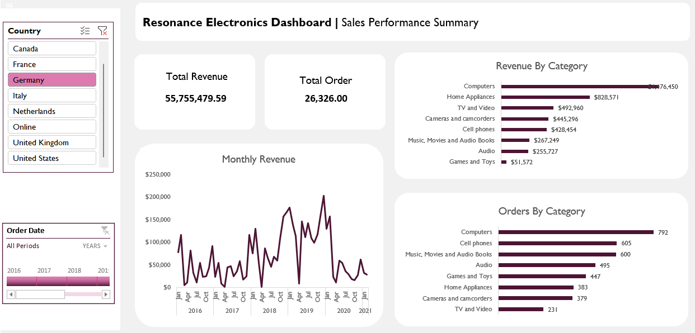

# Sales-Dashboard

Source-The data set is taken from Maven Analytics Youtube Channel: https://www.youtube.com/watch?v=GsjCixoyOnE&t=2s

Objective  

The purpose of this dashboard is to analyze revenue trend over year and to slice and dice revenue and total order by country and product category. By knowing the sales revenue trend, this would help company make informed decision on how to boost their sales by diiferent apporach via marketing, ads and seasonal promotion

For this project, I took on the role of a Data Analyst at Resonance Electronics, a global electronics retailer. I was tasked with delivering a brand-new sales performance report for regional managers with the catch that the data was scattered across SQL databases, CSV files, and static PDF.

Key Questions
1. What is the monthy revenue trend?
2. What is the top performing product category with largest revenue and order count?

Tools   
1. Microsoft Excel: Pivot Table, Power Pivot, Power Query, DAX
2. Database: MySQL

For the purpose of this exercise, I uploaded the dataset into MySQL so I could practice connecting it directly to Power BI. This allowed me to replicate the same analysis process in Power BI, gain hands-on experience with live database connections, and compare workflows between Excel and Power BI.

To tackle this challenge, I leveraged modern Excel tools to streamline the workflow
1. Power Query to connect to multiple sources, extract the necessary data, and transform it into a clean, consistent format.
2. Power Pivot to build a relational data model that linked all datasets together without writing complex formulas.
3. DAX (Data Analysis Expressions) to create calculated measures for advanced metrics like total revenue, sales by product category, and year-over-year performance.

Once the model was in place, I designed an interactive sales dashboard using Pivot Charts and slicers. This allowed regional sales managers to quickly filter and analyze data by region, product category, and time period, enabling them to identify revenue trends and top-performing products.

The result was a single, dynamic report that consolidated multiple messy data sources into a clear, actionable tool to delivered on time and ready to support business decisions.

Learning Takeaways
1. Learnt how to connect data from multiple sources into Excel
2. Learnt how import database into MySQL and linked it into Excel
3. Learnt how to create visualizations using Excel by leveraging Pivot Table, Power Query and Pivot Chart and consolidated them into a dashboard

